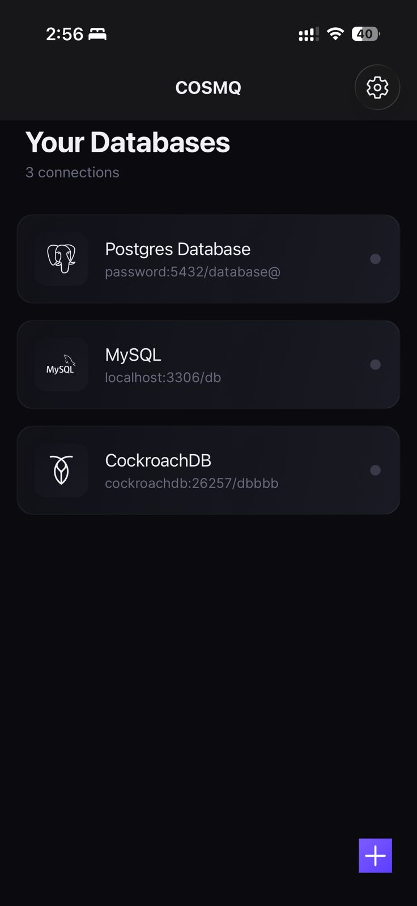
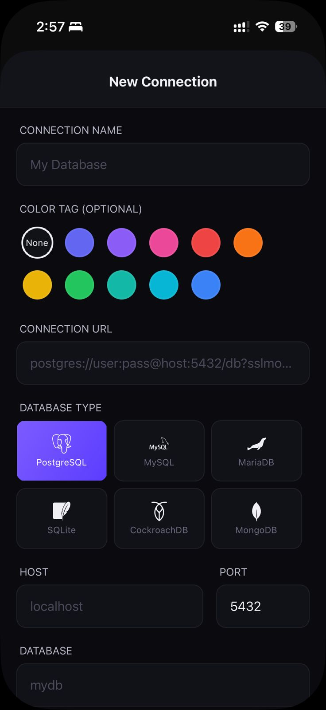
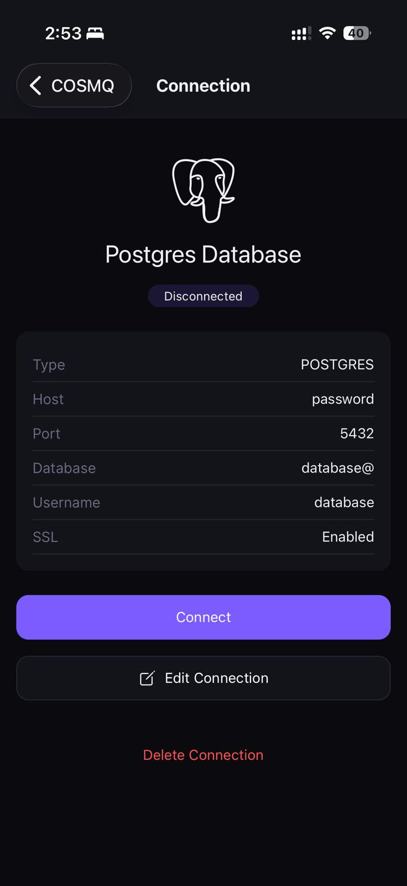
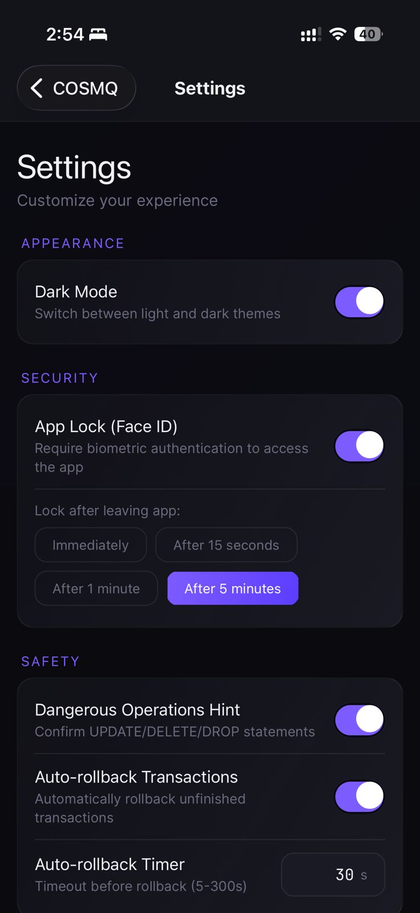

<p align="center">
  
</p>

<h1 align="center">COSMQ</h1>
<p align="center">Open-source mobile database client. Pronounced "cosmic".</p>

COSMQ (**C**lient **O**pen-**S**ource **M**obile **Q**uery) connects directly to PostgreSQL, MySQL/MariaDB, CockroachDB, MongoDB, and SQLite from iOS and Android. No proxy, no REST gateway — the app speaks each database's wire protocol over TCP.

## Screenshots

<p align="center">
  
  
  
  
</p>

## Database support

| Engine | Auth | SSL/TLS | Schema browser | Transactions |
|---|---|---|---|---|
| PostgreSQL | Cleartext, MD5, SCRAM-SHA-256 | Yes | Yes | Yes |
| MySQL / MariaDB | Native, Caching SHA2 | Yes | Yes | Yes |
| CockroachDB | (PostgreSQL wire) | Yes | Yes | Yes |
| MongoDB | SCRAM-SHA-1 | Yes | Yes (collections) | n/a |
| SQLite | — | — | Yes | Yes |

## Features

**Connections**
- Save, edit, color-tag, and swipe-delete multiple connections
- Passwords stored in the device keychain (`expo-secure-store`); metadata in `AsyncStorage`
- Optional biometric app lock (Face ID, Touch ID, fingerprint, iris) with idle-timeout
- Connection pool with idle eviction

**Query editor**
- Tokenized syntax highlighting
- Context-aware autocomplete (knows you're after `FROM`, inside `SET`, etc.)
- Quick-action keyword chips and starter templates (toggle in Settings)
- Run, copy cell, copy all results

**Schema browser**
- List tables and views, expand to see columns and types

**Transactions**
- `BEGIN` / `COMMIT` / `ROLLBACK` from a banner above results
- Optional auto-rollback timer (10–600s) so a forgotten transaction can't sit open

**Safety**
- Confirms before running `UPDATE`, `DELETE`, `DROP`, `TRUNCATE`, `ALTER`, `MERGE`, `REPLACE`
- Configurable per-connection

**History & snippets**
- Last 50 queries kept per device, deduped, searchable
- Save named snippets to keep around

**Other**
- Light and dark themes, JetBrainsMono editor font
- Haptic feedback on success / error / transaction events
- Reanimated v4 animations (pulse rings, fades, springs); honors Reduce Motion

## Quick start

```bash
bun install
bun --filter @cosmq/mobile dev
```

Then press `i` for iOS, `a` for Android, or `w` for web.

For native builds you'll want a development client:

```bash
cd apps/mobile
bunx expo prebuild --clean
bunx expo run:ios       # or run:android
```

Production builds go through EAS:

```bash
bunx eas build --platform ios
bunx eas build --platform android
```

## Architecture

```
React Native (Expo) ──▶ Zustand connection store
                              │
                              ▼
                       Protocol adapter
            ┌──────────┬──────────┬──────────┬──────────┐
            ▼          ▼          ▼          ▼          ▼
        Postgres v3  MySQL    MongoDB   SQLite    (more)
            │          │          │       (expo-sqlite)
            └──────────┴──────────┘
                       ▼
              react-native-tcp-socket
                       ▼
                  Database server
```

Each protocol implements the same `DatabaseConnection` interface (`connect`, `query`, `listTables`, `describeTable`, …) — the UI doesn't care which engine is on the other end.

## Repo layout

```
apps/
  mobile/        # Expo / React Native app
    app/         # expo-router screens
    components/  # UI + Tamagui-based primitives
    lib/
      protocols/ # postgres, mysql, mongodb, sqlite, mock
      tcp/       # TCP + TLS socket wrapper
      storage/   # connections, query history, snippets
      app-lock.ts, pool.ts, haptics.ts, settings.ts, theme.ts
    stores/      # Zustand stores (connection, settings)
  landing/       # Marketing site
packages/
  tsconfig/      # Shared tsconfig
```

Monorepo runs on Bun + Turborepo. Lint/format with Biome.

## Roadmap

Not yet shipped:

- SSH tunneling
- Cloud sync for connections (encrypted, opt-in)
- Export results to CSV / JSON / SQL `INSERT`
- Result-set pagination for large queries
- Schema diff between connections
- Query performance / `EXPLAIN` viewer
- Visual query builder

## Security

Treat this like any other database client.

- Passwords live in the OS keychain, never in plain logs or snapshots.
- Use SSL/TLS on anything past localhost.
- Avoid pointing it at production from a shared device. Turn on the biometric app lock if you do.
- Prefer read-only DB users when poking around on the road.

## Contributing

Issues and PRs welcome. See [CONTRIBUTING.md](CONTRIBUTING.md). Security reports: see [SECURITY.md](SECURITY.md).

## License

[MIT](LICENSE).
